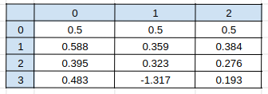

# NeuralNetwork_XOR
Basic XOR Neural Network

Variable values Table

Sinapse 0 sum
Entry(4x2)x weight0(2x3)
Four records of two neurons each, to be multiplied by three weights each neuron, 
resulting in three neurons each record.

Result (4x3)

Hidden Layer(4x3)
Pass the value of hidden layer neurons through the sigmoid activation function

Sum Synapse 1
Hidden Layer (4x3) x 1 weights (3x1)
Four three neurons for each record, to be multiplied by three weights, resulting in one neuron for each record.

Resutl (4x1)

Output Layer
Pass the output layer neuron value through the sigmoid activation function

Error
Error for each record = outputs - output layer

Error result

Absolute mean between the absolute values ​​of the errors.

Result
0.4988

Gradient
The derivate of the sigmoid is:

Neural Network scheme

